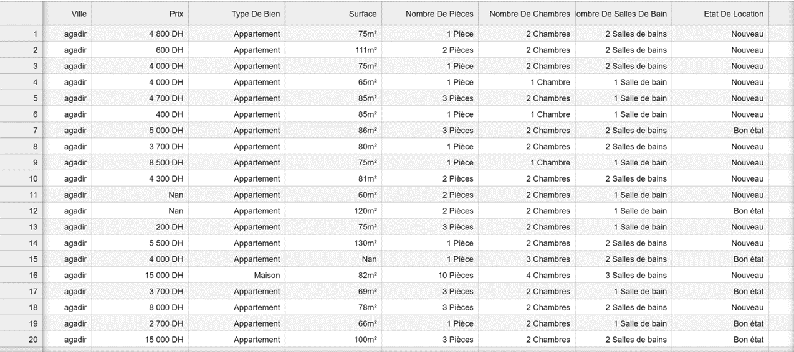

# Project Presentation 
## Project Overview
Project focuses on predicting rental prices for Moroccan properties using advanced ML techniques, addressing a classic regression problem. Additionally, aims to uncover key factors influencing rental prices across select Moroccan cities.

## Data Collection
Our data:
 - was collected from the Moroccan website “Mubawab” on 
 - November 21 and 22, 2023.
 - Has in total 10,549 records. 
 - Concerns ten Moroccan cities: Agadir, Bouskoura, Casablanca, Dar-Bouazza, Kénitra, Marrakech, Mohammedia, Rabat, Salé, and Tangier.
 - Initially has 30 features, including Price, City, Type of Property, Area, Number of Rooms, Presence of a Garden, a TV, etc.

## Methodology
### Data Pre-processing, Transformation & Feature Engineering

#### Missing Values
- Features with more than 35% of null values:
"Floor type" and "orientation" were removed due to their minimal impact on pricing.
- A linear regression imputation strategy was used for the ‘’Floor” attribute.
- ‘Age of Rental’ was removed due to its highly negative correlation with ‘Rental Status’ feature.

#### Feature Transformation
- ’City ’’ attribute was one-hot encoded.

- EUR entries were converted to DH.

- Properties were categorized: apartments as '1', houses as ‘0’.

- Binary features were represented by ‘1’ if present and ‘0’ otherwise.

- ‘’Rental status‘’ was mapped: '2' for new properties, '1' for well-maintained ones.

- Duplicated entries were removed.

- Null values were dropped.

  #### Dataset before

 #### Dataset after

#### Outliers handling
We did not observe any influential outliers in the dataset, except in the “Price” and “Area” variables. By using the IQR method, we drop them with the exception of those that seem to be real.

##### Interquartile Range (IQR) Method :

x is an outlier if:

x < Q1 - 1.5  * IQR    OR    x >  Q3 + 1.5  * IQR       Where:
Q1   = 25th percentiles,  Q3   = 75th percentiles,      IQR = Q3   -  Q1

#### Rooms attribute Outliers

#### Price & Area Outliers

#### Dataset With Outliers

#### Dataset Without Outliers

#### Feature Selection by PCA Technique:
We applied the PCA technique for data reduction and experimented with different numbers of components. However, the explained variance ratio was insufficient, suggesting that PCA might not be suitable for our case. Therefore, we decided to retain all the features.

## Data Analysis

We started the Data Analsis stage by examing the correlation between the differennt variables.
- Correlation Between Numerical Features

 We notice a considerable correlation between ‘’Price’’ and room attributes

- Correlation Between Binary Features

We identified strong correlations among 'TV’ , ’Refrigerator, ’ Oven'  and ‘Furnished' attributes.

### General Analysis of Single Factors
Regression models were used to analyze 'room attributes’, Floor', and Area' impact on rent. The 'room attributes' are a sum of Number of Rooms', ‘Number of Bedromms', and ‘Number of Bathrooms'. R² values for each regression are compared in the figure.

### Effects of Different Cities
Regression models were used to analyze 'room attributes', 'Etage', and 'Surface' impact on rent. The 'room attributes' are a sum of 'Nombre de chambres', 'Nombres de pièces', and 'Nombre de Salles De Bains'. R² values for each regression are compared in the figure.

## Model Selection

### Linear Regression
As a baseline measure, we performed a standard linear regression model with an Elastic Net loss function, after  the normalization pre-processing step.

### Decision Tree Regression
Decision Tree Regression (DTR) is a powerful supervised learning algorithm predominantly used for solving regression problems. It operates by partitioning the input space into regions, and then fitting a simple model (like a constant) in each one. Key parameters such as max_depth, min_samples_leaf and min_samples_split control the complexity and size of the tree, 

### Random Forest Regression
Random Forest Regression is a meta-estimator that fits a number of decision trees on various sub-samples of the dataset and uses averaging to improve the predictive accuracy and control overfitting.The key parameters of a Random Forest include n_estimators, criterion, max_depth, min_samples_split, and min_samples_leaf.

### Gradient Boosting Regression
Gradient Boosting is a technique that progressively builds a sophisticated regression model, referred to as H, by incorporating simple models in an iterative manner. Every additional simple model in the ensemble is designed to rectify the shortcomings of the existing ensemble.

## Results & Discussion

#### Hyperparameters tuning
For each of these models, we employ GridSearchCV from Scikit-Learn. This method allows us to systematically explore multiple combinations of parameters, cross-validate each one, and determine which configuration yields the best performance.

#### Evaluation Metrics
The evaluation metrics used in this study are the Root Mean Squared Error (RMSE) and the Coefficient of Determination, denoted as R². 

#### Model Comparison
##### R²

##### RMSE 

#### Model Selection

Comparison of Random Forest Regression’s predicted results and original test set

### Thanks for Your Attention

### project report on ResearchGate: https://shorturl.at/hBGOU
